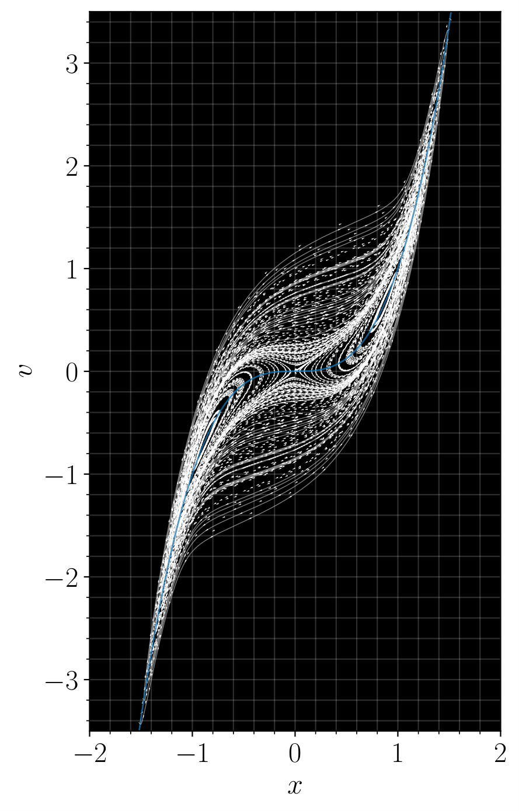

# Score-Based Transport Modelinng
This repository provides an efficient implementation in ``jax`` of the score-based transport modeling algorithm for solving the Fokker-Planck equation in high dimension.

More generally, it provides an efficient implementation in ``jax`` of score-based transport solutions of the Fokker-Planck equation. This method may also find applications in flow-based solutions of other high-dimensional partial differential equations using machine learning.

# Installation
The implementation is built on Google's [``jax``](https://github.com/google/jax) package for accelerated linear algebra and Deepmind's [``haiku``](https://github.com/deepmind/dm-haiku) package for neural networks. Both can be installed by following the guidelines at the linked repository.

# Usage
Experiments from the paper can be reproduced by running the files contained in the ``experiments`` directory.

The main implementation of the algorithm can be found in ``sbtm_sequential.py``, while analysis routines used for the results in the publication can be found in ``sbtm_analysis.py``.

Other systems can be implemented by adding the needed dynamics to ``drifts.py``.


# Referencing
If you found this repository useful, please consider citing

[1] 

```
@misc{boffi2023probability,
      title={Probability flow solution of the Fokker-Planck equation}, 
      author={Nicholas M. Boffi and Eric Vanden-Eijnden},
      year={2023},
      eprint={2206.04642},
      archivePrefix={arXiv},
      primaryClass={cs.LG}
}
```


